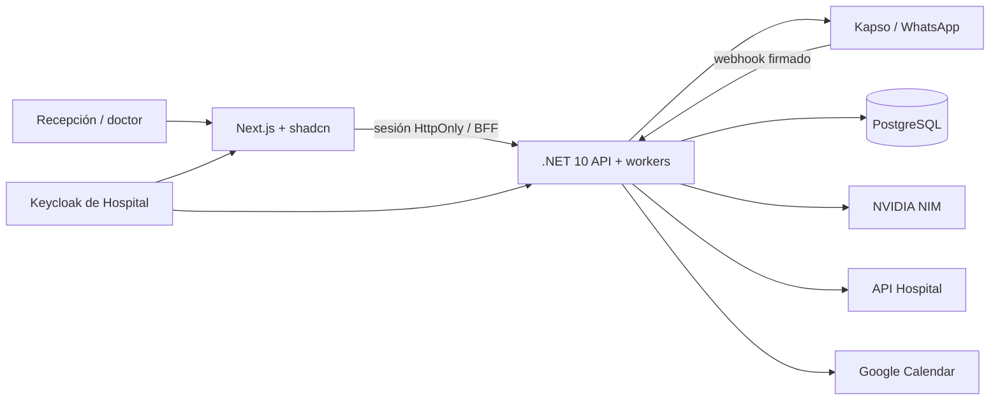

# Recepción · Hospital CRM

CRM de atención hospitalaria con bandeja WhatsApp, agente con herramientas, contactos, empresas, seguimientos, historial y agenda. Inspirado en el enfoque de [Comp AI CRM](https://github.com/trycompai/crm); implementación propia en Next.js/shadcn, .NET 10 y PostgreSQL.

**Estado:** aplicación funcional y probada localmente en contenedores. El uso con pacientes reales requiere conectar Keycloak/Hospital, Google OAuth y los números de negocio, y completar la validación operativa indicada en [despliegue](docs/deployment.md). Las credenciales de prueba no equivalen a una puesta en producción.

## Iniciar localmente

Requisitos: Docker Compose, Python 3 y el stack de [Hospital](../Hospital) en marcha con sus usuarios sintéticos (`KC_SEED_DEV_USERS=true`). Su Keycloak es el único inicio de sesión de Recepción, también en desarrollo. Node 22 LTS sólo si desarrollas o ejecutas las pruebas de navegador fuera del contenedor.

```sh
python3 scripts/init-dev.py              # .env con secretos locales aleatorios
python3 scripts/connect-hospital-local.py   # apunta al realm local de Hospital
docker compose -f docker-compose.yml -f docker-compose.hospital.yml up -d --build
```

`connect-hospital-local.py` pide que `Hospital/.env` declare los `KC_RECEPCION_*` (ver [despliegue](docs/deployment.md)) y que su job `keycloak-config` haya corrido. Abre [Recepción local](http://localhost:3215) y pulsa **Continuar con mi cuenta del hospital**: `dev-administrador-a`, `dev-recepcion-a` y `dev-medicos-a` comparten el hospital de demostración; `dev-administrador-b` es otra empresa; los `-c` pertenecen a la clínica conectada al Hospital local. La contraseña es `KC_DEV_USERS_PASSWORD` de Hospital. La base contiene exclusivamente ejemplos sintéticos.

La API escucha en `127.0.0.1:5215`, el frontend en `127.0.0.1:3215`; PostgreSQL sólo está disponible en la red de contenedores. `SEND_ENABLED=false`, `KAPSO_MANUAL_SEND_ENABLED=false`, canales pausados y agente desactivado por defecto impiden envíos accidentales. Para atención manual en ambas bandejas, activa el canal y `KAPSO_MANUAL_SEND_ENABLED=true`; puedes conservar `SEND_ENABLED=false` y el agente apagado. El permiso manual no autoriza envíos del agente. Ninguna clave va en variables `NEXT_PUBLIC_*`.

## Funciones

- Un solo proveedor de identidad: el Keycloak de Hospital. Sin usuarios ni contraseñas propios; tres perfiles derivados de los roles del hospital y membresía única. Aislamiento de empresa en API, persistencia, canales, herramientas del agente y auditoría.
- Contactos con búsqueda/paginación, empresas y convenios, oportunidades por etapas, actividades y notas persistentes.
- Actividad identifica atención del agente IA, recepción humana y doctores, con paciente, acción, entrega y acceso a la conversación. Búsqueda por paciente, teléfono, profesional o nota; filtros por tipo, acción y fechas del hospital, y paginación de 30 registros. Los eventos nuevos conservan el rol al realizar la acción; los anteriores aparecen como «Histórico sin rol». La consulta clínica registra únicamente que se consultó Hospital.

- Bandeja con conversaciones, asignación, pausa/reanudación, historial, estados de entrega, archivos y audios. Transcripción si Kapso la proporciona; en su ausencia, revisión humana.
- Alta de clientes Kapso por hospital, enlaces de conexión y múltiples números generales o de doctores. La coexistencia se verifica en Kapso; ecos desde Business App pausan al bot.
- Agente WhatsApp con NVIDIA NIM configurable: guía del negocio, horarios, consulta de citas propias, propuestas de agenda con confirmación, recetas firmadas y transferencia al equipo. No crea ni modifica prescripciones.
- Asistente interno para métricas anónimas, notas y seguimientos del contacto seleccionado. La selección se resuelve en servidor; no se cargan fichas ni historiales al prompt interno.
- Agenda de Hospital como fuente; consultar, crear, reprogramar y cancelar mediante su API. Google Calendar recibe un espejo sin nombres ni teléfonos de pacientes.
- Recordatorios por plantillas UTILITY a las 09:00 del día anterior y una hora antes, autorización por paciente, baja por WhatsApp y conciliación con Hospital. Configuración y cola en Agente de atención.
- Entrega de la última receta firmada seleccionada en servidor por fecha de firma, incluyendo todas las páginas disponibles.
- Cola persistente, deduplicación de webhooks, firma HMAC, auditoría y tratamiento explícito de entregas inciertas.

## Arquitectura



La búsqueda de Actividad recorre el historial elegible del hospital, incluso registros anteriores a los últimos 150. Nombres y notas permanecen cifrados en PostgreSQL y se filtran en servidor; para historiales muy grandes se debe medir el coste antes de escalar este mecanismo. Los códigos de confirmación y el JSON de propuestas del agente no se incluyen en este historial.

El navegador no recibe tokens de proveedor. El tenant procede del JWT firmado; en webhooks se resuelve por el número registrado. El teléfono y el vínculo al paciente se comprueban contra Hospital antes de cada consulta privada. Los PDFs pasan en memoria, sin enlaces públicos permanentes.

La sesión vencida muestra un aviso único y pausa las consultas. El usuario inicia sesión en otra pestaña y vuelve al mismo formulario o conversación, con sus borradores en memoria. No cerrar ni recargar la pestaña original: no se guardan borradores clínicos en el almacenamiento del navegador. La recuperación valida usuario y hospital; una cuenta diferente abre un espacio limpio. No se reenvían mensajes ni operaciones fallidas. Los accesos directos conservan una ruta de retorno local validada.

El BFF agrupa renovaciones simultáneas del token de Keycloak dentro de un proceso Node y distingue `invalid_grant` (401) de fallos temporales de conexión/proveedor (503). El caché de renovación es acotado y efímero; varias réplicas necesitan un coordinador compartido de sesiones/renovación. Se mantienen los tiempos de expiración existentes.


## Verificación

```sh
python3 tests/api_smoke.py
scripts/test-backend.sh
npm ci --prefix frontend
cd frontend
npx playwright install chromium
npm test
```

Las pruebas API y navegador inician sesión en el Keycloak local de Hospital con sus usuarios sintéticos (leen `KC_DEV_USERS_PASSWORD` de `../Hospital/.env` o del entorno); no se ejecutan contra producción ni en CI, que sólo corre lo que no necesita identidad. Backend usa una base temporal de PostgreSQL que se elimina al terminar y proveedores simulados. Las pruebas reales opcionales `scripts/check-integrations.py`, `scripts/kapso-mcp-read.py`, `scripts/check-nim.py` y `tests/assistant_smoke.py` requieren las claves locales; las pruebas NIM usan texto sintético y consumen cuota.

`scripts/eval-agent.sh [modelo]` corre las evals del agente de atención contra el modelo real con pacientes sintéticos (consume cuota; no forma parte de `test-backend.sh`).

[Agente de atención: alcance, guardas y evals](docs/reception-agent.md) · [Agente de citas y recordatorios](docs/appointment-agent.md) · [Resultados y límites de validación](docs/verification.md) · [Backlog](docs/backlog.md) · [Easypanel y operación](docs/deployment.md) · [Contrato Hospital](docs/hospital-integration.md) · [Puente de recetas](integrations/hospital/README.md)
